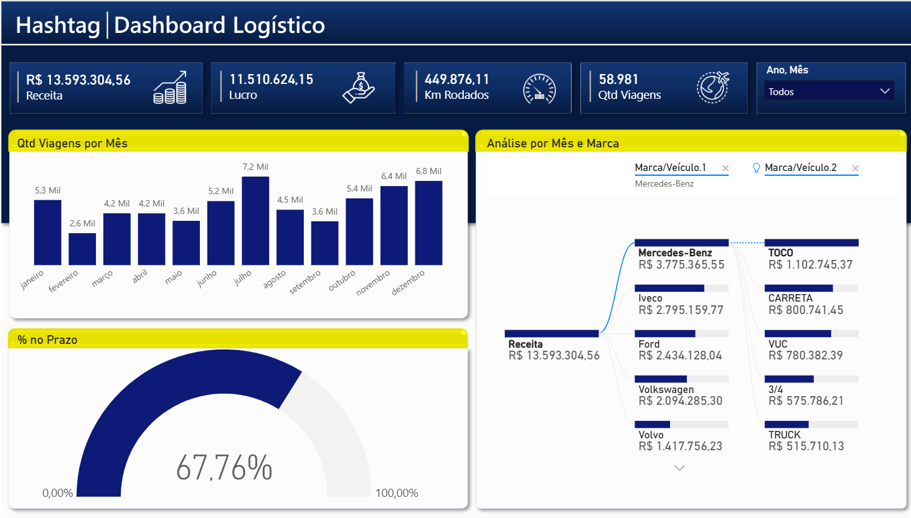

# 🚚 Dashboard Logístico | Power BI


## 📖 Sobre o Projeto

Este projeto consiste na construção de um **Dashboard Logístico** utilizando **Power BI**, com o objetivo de transformar dados operacionais em informações estratégicas para apoio à tomada de decisão.

A base utilizada contém aproximadamente **59 mil viagens**, permitindo analisar indicadores financeiros, produtividade da operação, desempenho da frota e cumprimento de prazos de entrega.

O dashboard foi desenvolvido seguindo boas práticas de modelagem e visualização de dados, oferecendo uma visão executiva da operação logística.

---

## 🎯 Objetivos

- Monitorar os principais indicadores da operação logística.
- Identificar oportunidades de melhoria na rentabilidade.
- Avaliar o desempenho da frota.
- Acompanhar a quantidade de viagens realizadas.
- Medir a eficiência das entregas dentro do prazo.
- Facilitar análises por período e tipo de veículo.

---

## 📊 Indicadores (KPIs)

O dashboard apresenta os seguintes indicadores principais:

- 💰 Receita Total
- 📈 Lucro
- 🚛 Quilômetros Rodados
- 📦 Quantidade de Viagens
- ⏱ Percentual de Entregas no Prazo

---

## 📈 Análises disponíveis

### Quantidade de viagens por mês

Permite acompanhar a sazonalidade da operação ao longo do ano, identificando meses com maior e menor volume de entregas.

---

### Receita por Marca e Veículo

Utilizando o gráfico de decomposição (Decomposition Tree), é possível analisar a receita em diferentes níveis:

- Marca do caminhão
- Tipo de veículo

Exemplo de análises:

- Qual marca gera maior faturamento?
- Qual tipo de veículo é mais rentável?
- Como cada veículo contribui para a receita total?

---

### Eficiência das Entregas

O velocímetro apresenta o percentual de entregas realizadas dentro do prazo estabelecido.

Esse indicador permite acompanhar a qualidade operacional e o nível de serviço prestado aos clientes.

---

## 🎛 Recursos do Dashboard

- Segmentação por Ano e Mês
- Navegação intuitiva
- Indicadores executivos
- Gráficos interativos
- Árvore de decomposição
- Layout voltado para tomada de decisão

---

## 🗂 Base de Dados

A base contém aproximadamente:

| Informação | Quantidade |
|------------|-----------:|
| Registros | 58.981 |
| Marcas de caminhões | 5 |
| Tipos de veículos | 5 |
| Período analisado | 12 meses |

### Principais campos

- Data do Pedido
- Data de Entrega
- Prazo de Entrega
- Motorista
- Endereço
- Marca do Veículo
- Tipo de Veículo
- Valor do Frete
- Quilometragem
- Custos de Combustível
- Custos de Manutenção
- Custos Fixos

---

## 🛠 Ferramentas utilizadas

- Power BI Desktop
- Power Query
- DAX
- Modelagem de Dados
- Excel

---

## 📚 Principais conceitos aplicados

- Limpeza de dados
- Tratamento de dados
- Modelagem estrela
- Medidas em DAX
- KPIs
- Indicadores financeiros
- Dashboard Executivo
- Visualização de Dados
- Storytelling com Dados

---

## 💡 Insights obtidos

Durante a análise foi possível observar:

- O volume de viagens apresenta variações ao longo dos meses.
- A Mercedes-Benz representa a maior participação na receita.
- O veículo do tipo TOCO possui maior contribuição financeira entre os modelos.
- Aproximadamente **68% das entregas** ocorreram dentro do prazo.
- O dashboard permite identificar rapidamente oportunidades para otimizar custos e aumentar a eficiência operacional.

---

## 📷 Dashboard



```
/images/dashboard_concluido.png
```

---

## 🚀 Possíveis melhorias futuras

- Comparativo entre anos.
- Análise por região.
- Ranking de motoristas.
- Indicadores de custo por quilômetro.
- Tempo médio de entrega.
- Margem de lucro por veículo.
- Análise de combustível.
- Drill-through para detalhamento das viagens.

---

## 👨‍💻 Autor

**Juliano Neres**

Estudante de Análise e Desenvolvimento de Sistemas e entusiasta de Dados, Power BI, SQL e Analytics.

Conecte-se comigo no LinkedIn e acompanhe meus projetos de Data Analytics.
